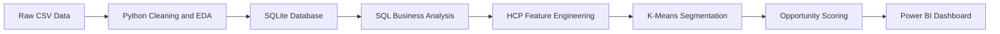
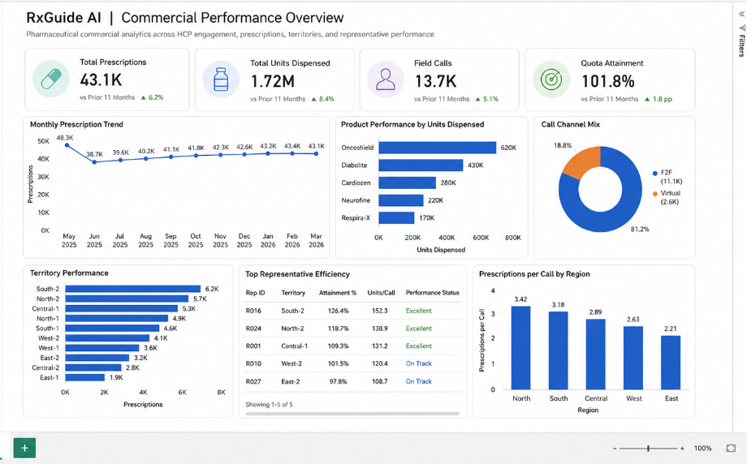
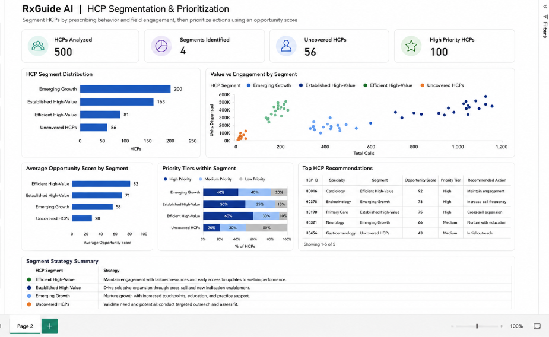

# RxGuide AI — HCP Analytics & Segmentation

[](https://www.python.org/)
[](https://www.sqlite.org/)
[](https://scikit-learn.org/)
[](https://powerbi.microsoft.com/)

An end-to-end pharmaceutical commercial analytics project using **Python, SQL, K-Means clustering, opportunity scoring, and Power BI** to segment Healthcare Professionals (HCPs), identify field-coverage gaps, and recommend targeted engagement actions.

---

## Project Overview

Pharmaceutical sales teams work with HCPs who differ in prescription value, growth, product adoption, and field engagement.

RxGuide AI answers four key questions:

| Component | Business Question |
|---|---|
| Python & SQL | What is happening across prescriptions, products, territories, and field calls? |
| K-Means | What type of HCP is this? |
| Opportunity Score | Which HCPs should be prioritized? |
| Power BI | What action should the commercial team take? |

---

## Project Highlights

- Processed and validated **31K+ records** across **500 HCPs, 50 sales representatives, and 5 products**
- Corrected **49 inconsistent tenure records**
- Aggregated **1,093 repeated HCP-product-month combinations**
- Created a reusable SQLite feature view with **one row per HCP**
- Identified **56 HCPs with zero field-call coverage**
- Detected an uncovered territory containing **40 active prescribers but no assigned representatives or calls**
- Segmented all 500 HCPs into **four actionable behavioral groups**
- Created an explainable opportunity score and segment-specific recommendations
- Visualized clusters using PCA, capturing **68.36% of total feature variation**

---

## Workflow



---

## SQL Analysis

The SQL layer uses **CTEs, joins, window functions, ranking, and `LAG`** to analyze:

- HCP opportunity and undercoverage
- Representative efficiency and quota attainment
- Product month-over-month growth
- Territory performance
- Prescription and call engagement patterns

A reusable view named `vw_hcp_features` was created to generate model-ready HCP-level features.

---

## HCP Segmentation

K-Means was trained using six behavioral features:

| Feature | Meaning |
|---|---|
| `total_units_dispensed` | Current prescription value |
| `prescription_momentum` | Recent growth or decline |
| `total_calls` | Field engagement frequency |
| `prescriptions_per_call` | Engagement efficiency |
| `product_breadth` | Product adoption breadth |
| `days_since_last_call` | Engagement recency |

Models with two to six clusters were compared using silhouette score, inertia, cluster balance, and business interpretability.

Although two clusters achieved the highest silhouette score, it grouped **440 different covered HCPs into one broad segment**. Four clusters were selected because they produced clearer and more actionable commercial profiles.

---

## Final Segments

| Segment | HCPs | Recommended Strategy |
|---|---:|---|
| Established High-Value | 163 | Maintain engagement and protect existing value |
| Emerging Growth | 200 | Nurture growth through targeted follow-ups |
| Efficient High-Value | 81 | Prioritize selective engagement and expansion |
| Uncovered HCPs | 56 | Validate active prescribers before initiating outreach |

---

## Opportunity Score

HCPs were ranked within their own segment using a transparent scoring formula:

```text
30% Prescription Value
25% Undercoverage
20% Prescription Momentum
15% Engagement Efficiency
10% Product Breadth
```

Priority tiers were then assigned:

- **Top 20%:** High Priority
- **Next 30%:** Medium Priority
- **Bottom 50%:** Low Priority

The segment determines **how an HCP should be engaged**, while the score determines **who should be prioritized first**.

---

## Dashboard Preview

### Commercial Performance Overview

Tracks prescription trends, product performance, territory coverage, representative efficiency, call channels, and quota attainment.



### HCP Segmentation & Prioritization

Shows segment distribution, engagement patterns, opportunity scores, priority tiers, recommended HCP actions, and segment strategies.



> The images currently represent the planned Power BI layout. The analytical values and model outputs are available in the `outputs` directory.

---

## Repository Structure

```text
rxguide-hcp-analytics/
├── data/
│   ├── raw/
│   └── processed/
├── notebooks/
│   ├── 01_data_cleaning_and_eda.ipynb
│   ├── 02_sql_analysis.ipynb
│   └── 03_hcp_segmentation.ipynb
├── outputs/
├── powerbi/
├── scripts/
├── sql/
├── requirements.txt
└── README.md
```

---

## Technology Stack

- **Data Analysis:** Python, Pandas, NumPy, Matplotlib
- **Database:** SQLite, SQL
- **Machine Learning:** Scikit-learn, K-Means, StandardScaler, PCA
- **Business Intelligence:** Power BI

---

## Run Locally

```bash
git clone https://github.com/anupam-devcodes/rxguide-hcp-analytics.git
cd rxguide-hcp-analytics

python -m venv venv
venv\Scripts\activate

pip install -r requirements.txt
python scripts/setup_sqlite_database.py
```

Run the notebooks in order:

```text
01_data_cleaning_and_eda.ipynb
02_sql_analysis.ipynb
03_hcp_segmentation.ipynb
```

---

## Author

**Anupam Choubey**

- GitHub: [anupam-devcodes](https://github.com/anupam-devcodes)
- Repository: [rxguide-hcp-analytics](https://github.com/anupam-devcodes/rxguide-hcp-analytics)

---

## License

This project is licensed under the [MIT License](LICENSE).